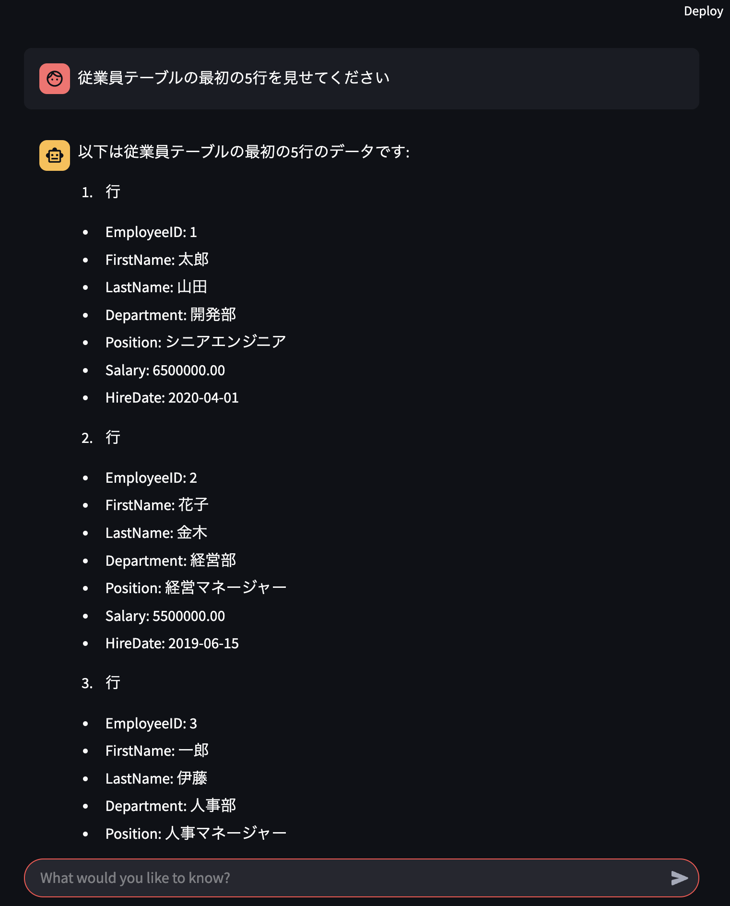
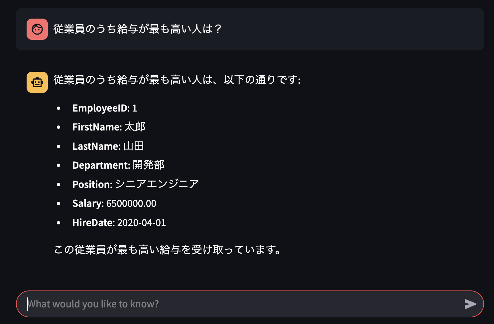

# MCP-SQLAlchemy

A sample project that builds MCP clients with llamacpp and runekaagaard/mcp-alchemy.

## Description

This project demonstrates the integration of MCP (Model Context Protocol) by Anthropic architecture with SQLAlchemy, using Llamacpp for open LLM models uploaded on Hugging Face.

## Installation

1. Clone the repository
2. Setup llamacpp server (preferably on GPU). Sample codes are assumed that this llamacpp server is running on GCP VM. See `llm-server/README.md` for details.
3. Run `docker compose up` to start the streamlit client

## Usage
`mssql` and `init-db` containers are samples. You can modify `DB_URL` as you need.

Run the Streamlit application:
```bash
docker compose up
```

## Screenshots




## References
- [MCP Alchemy](https://github.com/runekaagaard/mcp-alchemy)
- [llamacpp](https://github.com/ggerganov/llamacpp)
- [MCP(Model Context Protocol)のClientにOpenAI APIを利用する方法](https://note.com/gotalab/n/n8214fc9cc205)

## License

See the LICENSE file for details.